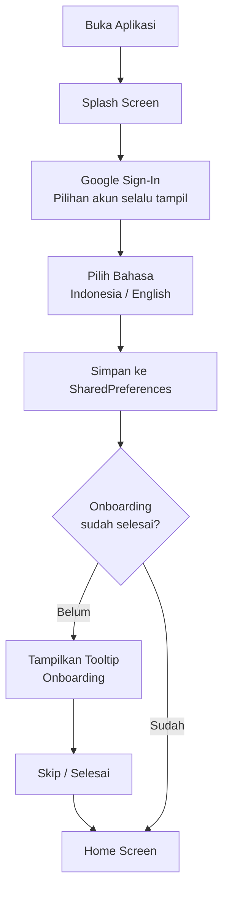
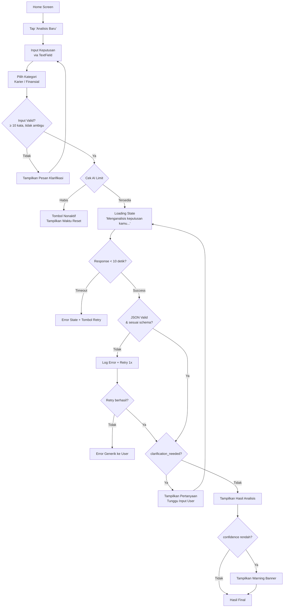
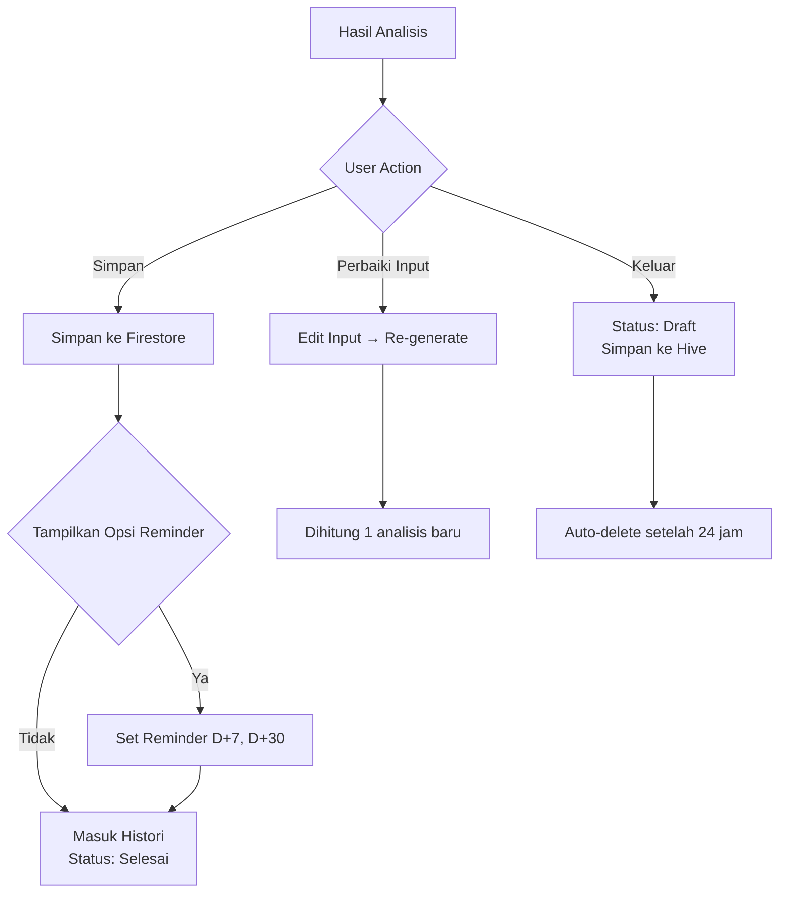
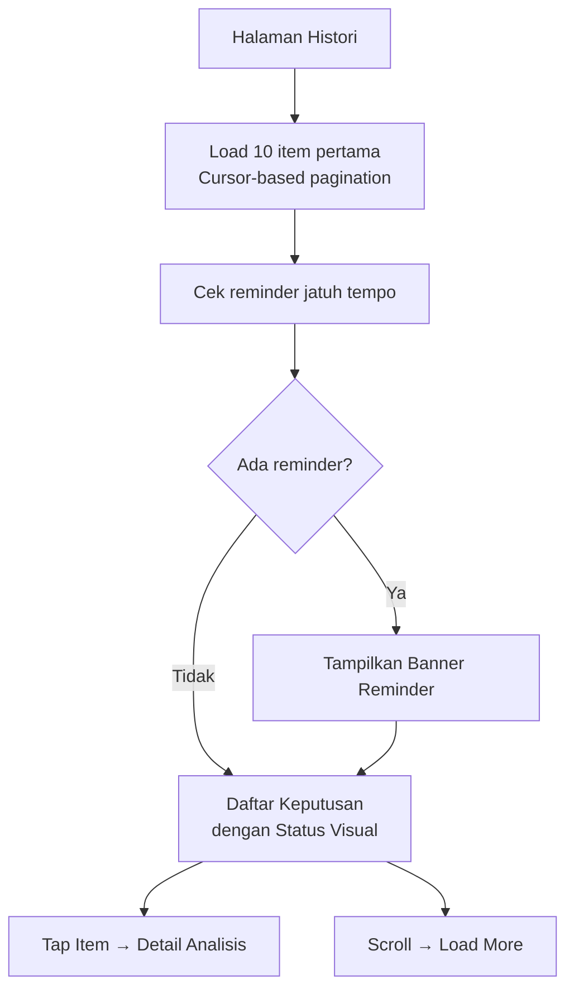
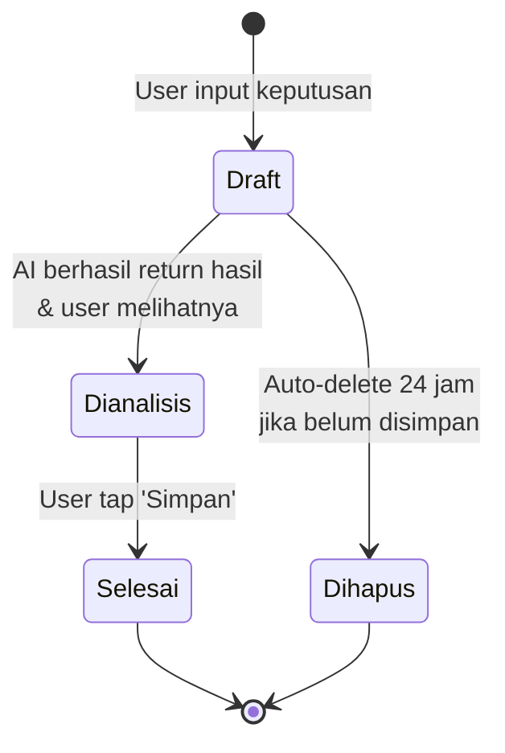

# 📋 Product Requirements Document (PRD)
## Nalara — Decision Intelligence Platform
**Versi:** 1.0.0-MVP | **Tanggal:** 6 Mei 2026 | **Status:** Draft

---

## 1. Executive Summary

**Nalara** adalah aplikasi decision intelligence berbasis AI yang membantu pengguna Indonesia mengurangi risiko kesalahan dalam pengambilan keputusan bernilai tinggi. Dengan pendekatan **pre-mortem analysis** yang ditenagai oleh Gemini AI, Nalara menyediakan simulasi kegagalan, identifikasi penyebab utama, indikator dini, dan tindakan preventif yang actionable.

> **Tagline:** *Keputusan lebih tajam, risiko lebih terlihat.*

### 1.1 Problem Statement

Berdasarkan riset pasar, knowledge worker Indonesia usia 20–40 tahun menghadapi empat masalah utama saat mengambil keputusan penting:

| # | Pain Point | Dampak |
|---|-----------|--------|
| 1 | **Overthinking** — terjebak dalam loop analisis tanpa framework | Keputusan tertunda, peluang hilang |
| 2 | **Fear of Regret** — takut menyesal setelah memilih | Paralisis keputusan |
| 3 | **No Structured Thinking** — tidak punya metode evaluasi risiko | Keputusan impulsif atau terlalu emosional |
| 4 | **Need for Second Opinion** — butuh perspektif objektif yang cepat | Bergantung pada opini orang lain yang belum tentu kompeten |

### 1.2 Proposed Solution

Nalara mengadopsi teknik **pre-mortem analysis** — sebuah metode yang digunakan di enterprise-level decision intelligence — dan membuatnya accessible untuk individu melalui AI. Alih-alih bertanya "apa yang bisa salah?", Nalara mengasumsikan keputusan **sudah gagal** dan menelusuri mundur untuk menemukan penyebabnya.

### 1.3 Market Opportunity

| Metric | Data |
|--------|------|
| Internet penetration Indonesia (2025) | ~80.5% (~229 juta pengguna) |
| Smartphone penetration (2025) | 86%, proyeksi 91.3% di 2028 |
| Adopsi AI oleh knowledge worker Indonesia | ~92% pernah menggunakan |
| Daily AI usage rate | ~16% |
| Target addressable market (knowledge workers 20-40) | ~35 juta pengguna |

---

## 2. Product Identity

| Attribute | Value |
|-----------|-------|
| **Nama Produk** | Nalara |
| **Tagline** | Keputusan lebih tajam, risiko lebih terlihat |
| **Platform** | Flutter (Web + Mobile: Android & iOS) |
| **Bahasa** | Indonesia, English |
| **Model AI** | Gemini 1.5 Flash via Cloud Functions |
| **Backend** | Firebase (Auth, Firestore, Cloud Functions) |
| **State Management** | Riverpod |
| **Local Storage** | Hive (cache/draft), SharedPreferences (preferensi ringan) |

---

## 3. Target Pengguna

### 3.1 Persona Primer

| Attribute | Detail |
|-----------|--------|
| **Lokasi** | Indonesia (urban & semi-urban) |
| **Usia** | 20–40 tahun |
| **Profil** | Knowledge worker, profesional, mahasiswa tingkat akhir |
| **Tech Savviness** | Menengah-tinggi, terbiasa dengan aplikasi mobile |
| **Frekuensi Keputusan Berat** | 2–5 keputusan signifikan per tahun |

### 3.2 User Persona Detail

#### Persona A: "Rina — Junior Professional"
- 25 tahun, 2 tahun pengalaman kerja
- Sedang mempertimbangkan pindah kerja ke startup
- Butuh framework untuk mengevaluasi risiko resign
- Biasa menggunakan AI tools untuk brainstorming

#### Persona B: "Budi — Mid-Career Professional"
- 33 tahun, team lead di perusahaan menengah
- Mempertimbangkan ambil KPR vs terus ngontrak
- Butuh analisis risiko finansial yang terstruktur
- Lebih konservatif, butuh data sebelum mengambil keputusan

#### Persona C: "Sari — Mahasiswa Tingkat Akhir"
- 22 tahun, semester 7
- Bimbang antara langsung kerja atau lanjut S2
- Cenderung overthinking dan mencari validasi
- Native digital user, ekspektasi UI/UX tinggi

---

## 4. MVP Scope

### 4.1 Fitur yang Dibangun (In Scope)

| # | Fitur | Prioritas |
|---|-------|-----------|
| 1 | Google Sign-In (non-silent, pilihan akun selalu tampil) | P0 |
| 2 | Language selection (ID / EN) dengan SharedPreferences | P0 |
| 3 | Onboarding tooltip singkat (skippable) | P1 |
| 4 | Input keputusan berbasis teks + kategori (Karier / Finansial) | P0 |
| 5 | Validasi input (min 10 kata, deteksi ambiguitas) | P0 |
| 6 | AI Analysis — 3 skenario kegagalan realistis | P0 |
| 7 | Identifikasi penyebab utama per skenario | P0 |
| 8 | Indikator dini (3 per skenario) | P0 |
| 9 | Tindakan pencegahan + timing relatif | P0 |
| 10 | Confidence level + reason (jika rendah) | P0 |
| 11 | Clarification flow (jika AI butuh info tambahan) | P0 |
| 12 | Simpan / Buang hasil analisis | P0 |
| 13 | Draft management (Hive, auto-delete 24 jam) | P1 |
| 14 | Histori keputusan + cursor-based pagination | P0 |
| 15 | In-app reminder (D+7, D+30) sebagai banner | P1 |
| 16 | AI usage limit (3/hari free) + server-side validation | P0 |
| 17 | System hard cap (1.400 req/hari) | P0 |
| 18 | Streak penggunaan di dashboard | P2 |
| 19 | Multilanguage UI (ARB files) | P0 |
| 20 | Offline draft support + auto-sync | P1 |

### 4.2 Out of Scope (MVP)

- Flowchart / visualisasi kompleks
- Google Calendar integration
- Personal bias profiling
- Collaborative workspace
- Analisis komparatif antar keputusan
- Push notification
- Social sharing
- Premium subscription / payment gateway
- Export PDF

---

## 5. User Journey

### 5.1 Onboarding Flow



**Aturan Onboarding:**
- Target selesai < 60 detik
- Google Sign-In: pilihan akun **selalu ditampilkan**, tidak boleh silent login
- Bahasa disimpan persisten di SharedPreferences
- Tooltip onboarding bisa di-skip kapan saja

### 5.2 Decision Analysis Flow



### 5.3 Save / Discard Flow



### 5.4 History Flow



---

## 6. State Machine Keputusan

### 6.1 State Diagram



### 6.2 Aturan Transisi

| Dari | Ke | Trigger | Tipe |
|------|----|---------|------|
| Draft | Dianalisis | AI return hasil + user melihat | Otomatis |
| Dianalisis | Selesai | User tap "Simpan" | Manual |
| Draft | Dihapus | 24 jam tanpa simpan | Otomatis |

> [!IMPORTANT]
> - **Tidak ada transisi mundur** — state hanya bergerak maju
> - **Firestore = single source of truth** — semua state final ada di server

---

## 7. AI Specification

### 7.1 Model & Configuration

| Parameter | Value |
|-----------|-------|
| Model | `gemini-1.5-flash` |
| Temperature | 0.3 |
| Max Output Tokens | 800 |
| Response Format | JSON only |
| Invocation | Melalui Cloud Functions (API key tidak di client) |

### 7.2 Output Schema (Kontrak)

```json
{
  "scenarios": [
    {
      "id": "s1",
      "title": "string (maks 10 kata)",
      "narrative": "string (maks 100 kata)",
      "likelihood": "rendah | sedang | tinggi",
      "main_cause": "string (maks 50 kata)",
      "early_indicators": ["string", "string", "string"],
      "prevention_actions": [
        {
          "action": "string (maks 30 kata)",
          "timing": "hari ini | besok | minggu ini | bulan ini"
        }
      ]
    }
  ],
  "overall_confidence": "rendah | sedang | tinggi",
  "confidence_reason": "string (maks 50 kata) | null",
  "clarification_needed": "string | null"
}
```

> [!CAUTION]
> Kontrak JSON ini **tidak boleh diubah tanpa koordinasi tim**. Perubahan schema mempengaruhi parsing di client, validasi di Cloud Functions, dan penyimpanan di Firestore.

### 7.3 Prompt Template

Disimpan di:
- `core/prompts/prompt_id.dart` (Bahasa Indonesia)
- `core/prompts/prompt_en.dart` (English)

Variabel template: `{category}`, `{json_schema}`, `{user_input}`

### 7.4 AI Guardrails

| Rule | Detail |
|------|--------|
| Input minimum | 10 kata, minta klarifikasi jika kurang |
| Clarification loop | Jika `clarification_needed != null`, tampilkan pertanyaan → tunggu input → proses ulang |
| Low confidence | Tampilkan banner warning |
| Token limit | Maks 800 token per request |
| Temperature | 0.3 untuk konsistensi |
| Prohibited output | Saran medis, hukum, investasi spesifik |
| Invalid JSON | Log error + retry 1x → error generik jika masih gagal |
| Generic output | Anggap invalid + retry 1x |
| Output language | Wajib sesuai bahasa pilihan user |
| Timing enum | Hanya: "hari ini/today", "besok/tomorrow", "minggu ini/this week", "bulan ini/this month" |

### 7.5 AI Usage Limits

| Limit | Value |
|-------|-------|
| Free user per hari | 3 analisis |
| Reset waktu | 00:00 WIB |
| Re-generate | Dihitung sebagai 1 analisis baru |
| Validasi | **Wajib di Cloud Functions** (bukan hanya client) |
| Logging | Dicatat di collection `ai_usage_logs` |
| System hard cap | 1.400 req Gemini/hari (seluruh app) |
| Hard cap action | Fitur AI nonaktif sementara + pesan ke user |

**UI Display:**
- Tampilkan sisa limit: "Tersisa 2 analisis hari ini"
- Jika habis: tombol Analisis nonaktif + waktu reset

---

## 8. Multilanguage

| Aspek | Detail |
|-------|--------|
| Bahasa didukung | Indonesia (`id`), English (`en`) |
| Storage | SharedPreferences |
| Implementation | Flutter localization + ARB files di `l10n/` |
| Coverage | Seluruh UI, status, label, timing, error messages |
| AI Output | Wajib mengikuti bahasa user (instruksi di prompt) |
| Hardcoded string | **Tidak boleh ada** di widget |

---

## 9. UI/UX Principles

### 9.1 Design Principles

1. **Mobile-first layout** — responsive untuk web
2. **Card-based interface** — setiap section terpisah dalam card
3. **Visual hierarchy** — judul besar, deskripsi kecil, aksi di bawah
4. **Content density** — maks 3 baris per card sebelum expand
5. **Single CTA** — satu primary action jelas per halaman, selalu visible
6. **No blocking modals** — kecuali aksi destruktif
7. **State clarity** — setiap state (loading, empty, error, success) punya visual berbeda
8. **Centralized styling** — semua design token di `core/theme/`

### 9.2 Screen Inventory (MVP)

| Screen | Primary CTA | Key States |
|--------|------------|------------|
| Splash | — | Loading |
| Login | Sign in with Google | Loading, Error |
| Language Selection | Lanjutkan | — |
| Onboarding Tooltip | Skip / Next | — |
| Home / Dashboard | Analisis Baru | Empty, Has History, Reminder Banner |
| Input Keputusan | Analisis | Input Invalid, Input Valid |
| Loading Analysis | — | Loading, Timeout Error, Offline |
| Hasil Analisis | Simpan | Low Confidence Warning, Clarification |
| Histori | Tap Item | Empty, Loading More, Reminder |
| Detail Histori | — | Has Notes, No Notes |

---

## 10. Retention & Engagement

| Mechanism | Detail |
|-----------|--------|
| **Histori Visual** | Status badge (Draft, Dianalisis, Selesai) per keputusan |
| **In-App Reminder** | Banner review D+7 dan D+30 (bukan push notification) |
| **Decision Follow-Up** | User bisa update status → Selesai + catatan hasil |
| **Usage Streak** | Ditampilkan di dashboard sebagai motivasi ringan |

---

## 11. Gap Analysis & Ide Kebaruan

Berdasarkan riset pasar dan competitive landscape, berikut gap dan peluang inovasi:

### 11.1 Gap di Pasar Saat Ini

| Gap | Opportunity untuk Nalara |
|-----|--------------------------|
| Enterprise DI tools tidak accessible untuk individu | Nalara demokratisasi pre-mortem analysis untuk personal use |
| AI tools Indonesia fokus produktivitas, bukan keputusan | Nalara isi niche "personal decision support" |
| Tidak ada tool lokal yang pahami konteks Indonesia | Prompt template dan output dalam Bahasa Indonesia |
| Existing tools tidak punya structured follow-up | Reminder D+7/D+30 untuk evaluasi keputusan |

### 11.2 Ide Kebaruan untuk Roadmap Post-MVP

| Fitur | Deskripsi | Prioritas |
|-------|-----------|-----------|
| **Decision Journal** | Catatan refleksi post-keputusan dengan AI-assisted insights | P1 |
| **Emotional Tagging** | Tag emosi saat input (panik, ragu, optimis) untuk bias awareness | P2 |
| **Success Scenario Balancing** | Tambahkan 1-2 skenario sukses sebagai counterweight | P1 |
| **Decision Quality Score** | Skor kualitas proses keputusan (bukan outcome) berdasar kelengkapan input | P2 |
| **Anonymous Benchmark** | "78% pengguna dengan keputusan serupa mengambil action X" | P3 |
| **Contextual Data Enrichment** | Integrasi data ekonomi Indonesia (inflasi, UMR, dll) untuk keputusan finansial | P2 |
| **Voice Input** | Input keputusan via speech-to-text untuk mobile | P3 |
| **Decision Template** | Template pre-filled untuk keputusan umum (resign, KPR, dll) | P1 |

---

## 12. Success Metrics (MVP)

| Metric | Target | Measurement |
|--------|--------|-------------|
| Onboarding completion rate | > 80% | Firebase Analytics |
| Input → Result time | < 10 detik | Cloud Functions logs |
| Daily active analysis rate | ≥ 1.5 analisis/user aktif | Firestore aggregation |
| Save rate (Dianalisis → Selesai) | > 50% | Firestore |
| D+7 reminder tap rate | > 20% | Firestore |
| D+30 retention rate | > 15% | Firebase Analytics |
| App crash rate | < 1% | Firebase Crashlytics |
| AI error rate | < 5% | Cloud Functions logs |

---

## 13. Assumptions & Constraints

### Assumptions
- User memiliki akun Google
- Koneksi internet tersedia saat login pertama dan analisis
- Gemini API tersedia dan stabil
- 1 akun Google = 1 profil Nalara

### Constraints
- MVP timeline: 8–10 minggu
- Budget: bootstrapped / early stage
- AI cost: Gemini 1.5 Flash pricing per token
- System hard cap: 1.400 req/hari → ~467 user aktif (3 analisis/hari)

---

## 14. Risk Register

| Risk | Likelihood | Impact | Mitigation |
|------|-----------|--------|------------|
| Gemini API downtime | Sedang | Tinggi | Error state + retry, cache hasil terakhir |
| Gemini output tidak konsisten | Sedang | Sedang | Temperature 0.3, strict schema validation, retry |
| Hard cap tercapai terlalu cepat | Rendah | Tinggi | Monitor usage, siap scale limit |
| User churn setelah 1x pakai | Tinggi | Tinggi | Reminder, streak, decision journal |
| Biaya AI membengkak | Sedang | Tinggi | Hard cap, token limit 800, usage monitoring |
| Data breach / leak | Rendah | Tinggi | Security rules, enkripsi, no API key di client |

---

## 15. Requirement Demo Checklist

- [ ] Onboarding selesai < 60 detik
- [ ] Input → hasil analisis < 10 detik
- [ ] UI clean, tidak ada elemen tidak perlu
- [ ] Satu aksi utama jelas di setiap screen
- [ ] Hasil analisis actionable dan tidak generik
- [ ] Semua state (loading, error, empty, success) tervisualisasi
- [ ] Bahasa Indonesia dan English berfungsi end-to-end
- [ ] AI limit ditampilkan dan di-enforce server-side
- [ ] Draft auto-delete setelah 24 jam
- [ ] Histori dengan pagination berfungsi

---

*Dokumen ini adalah living document dan akan diperbarui seiring perkembangan produk.*
