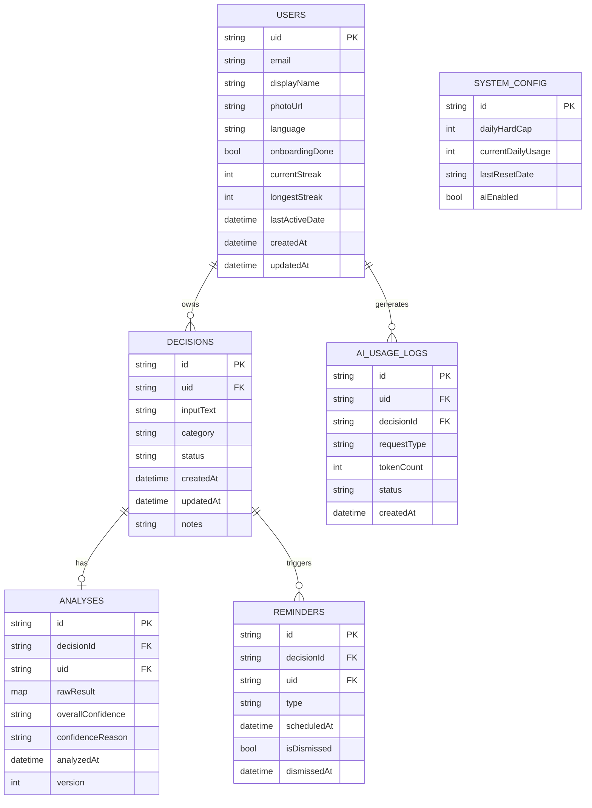
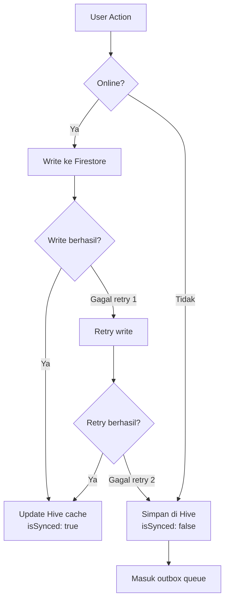
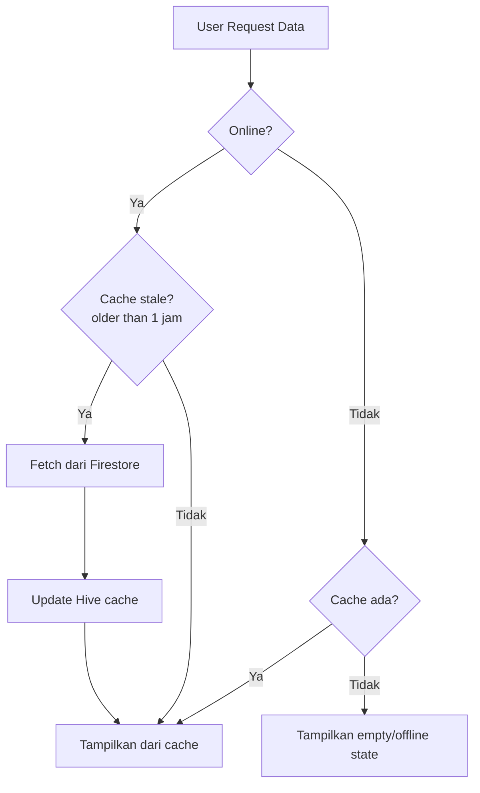
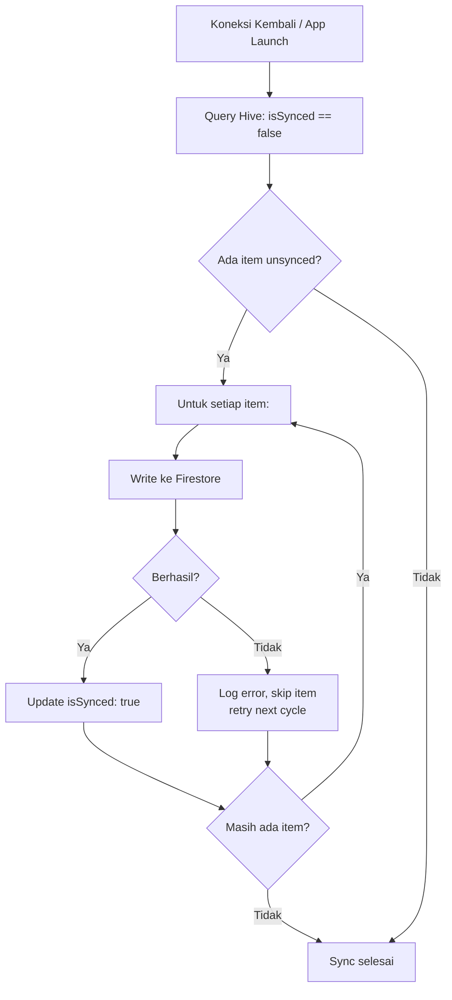

# 🗄️ Database Schema Document
## Nalara — Decision Intelligence Platform
**Versi:** 1.0.0-MVP | **Tanggal:** 6 Mei 2026 | **Status:** Draft

---

## 1. Overview

Nalara menggunakan arsitektur hybrid storage:

| Layer | Technology | Purpose |
|-------|-----------|---------|
| **Primary (Cloud)** | Firebase Firestore | Single source of truth, persistent storage |
| **Local Cache** | Hive | Draft management, offline cache, outbox queue |
| **Preferences** | SharedPreferences | Preferensi ringan (bahasa, onboarding status) |

### Design Principles

1. **Firestore = Single Source of Truth** — semua data final berada di Firestore
2. **Hive = Local-First Cache** — untuk draft, offline access, dan outbox sync
3. **SharedPreferences = Lightweight** — hanya untuk key-value preferensi sederhana
4. **User-Scoped Data** — semua data ter-isolasi per UID
5. **No Cross-User Access** — security rules mencegah akses data user lain

---

## 2. Entity Relationship Diagram



---

## 3. Firestore Collections

### 3.1 Collection: `users`

**Path:** `/users/{uid}`

Menyimpan profil dan preferensi user yang tersinkronisasi.

| Field | Type | Required | Default | Description |
|-------|------|----------|---------|-------------|
| `uid` | `string` | ✅ | — | Firebase Auth UID (document ID) |
| `email` | `string` | ✅ | — | Email dari Google Account |
| `displayName` | `string` | ✅ | — | Nama tampilan dari Google |
| `photoUrl` | `string` | ❌ | `null` | URL foto profil Google |
| `language` | `string` | ✅ | `"id"` | Bahasa pilihan: `"id"` \| `"en"` |
| `onboardingDone` | `bool` | ✅ | `false` | Status onboarding selesai |
| `currentStreak` | `int` | ✅ | `0` | Streak penggunaan saat ini (hari berturut) |
| `longestStreak` | `int` | ✅ | `0` | Streak terpanjang |
| `lastActiveDate` | `timestamp` | ❌ | `null` | Tanggal terakhir analisis |
| `createdAt` | `timestamp` | ✅ | `serverTimestamp()` | Waktu pembuatan akun |
| `updatedAt` | `timestamp` | ✅ | `serverTimestamp()` | Waktu update terakhir |

**Contoh dokumen:**
```json
{
  "uid": "abc123xyz",
  "email": "rina@gmail.com",
  "displayName": "Rina Wijaya",
  "photoUrl": "https://lh3.googleusercontent.com/...",
  "language": "id",
  "onboardingDone": true,
  "currentStreak": 3,
  "longestStreak": 7,
  "lastActiveDate": "2026-05-05T10:00:00Z",
  "createdAt": "2026-04-01T08:00:00Z",
  "updatedAt": "2026-05-05T10:00:00Z"
}
```

---

### 3.2 Collection: `decisions`

**Path:** `/users/{uid}/decisions/{decisionId}`

Menyimpan keputusan yang sudah disimpan user (status: `dianalisis` atau `selesai`).

| Field | Type | Required | Default | Description |
|-------|------|----------|---------|-------------|
| `id` | `string` | ✅ | — | Auto-generated ID (document ID) |
| `uid` | `string` | ✅ | — | Owner UID |
| `inputText` | `string` | ✅ | — | Teks keputusan user (min 10 kata) |
| `category` | `string` | ✅ | — | `"karir"` \| `"finansial"` |
| `status` | `string` | ✅ | `"draft"` | `"draft"` \| `"dianalisis"` \| `"selesai"` \| `"dihapus"` |
| `createdAt` | `timestamp` | ✅ | `serverTimestamp()` | Waktu input pertama |
| `updatedAt` | `timestamp` | ✅ | `serverTimestamp()` | Waktu update terakhir |
| `notes` | `string` | ❌ | `null` | Catatan follow-up dari user (saat review D+7/D+30) |

**Indexes:**
```
Collection: users/{uid}/decisions
  - status ASC, createdAt DESC  → untuk query histori per status
  - createdAt DESC              → untuk cursor-based pagination
```

**Contoh dokumen:**
```json
{
  "id": "dec_001",
  "uid": "abc123xyz",
  "inputText": "Saya sedang mempertimbangkan untuk resign dari pekerjaan saya sekarang dan bergabung dengan startup kecil yang menawarkan gaji 20% lebih rendah tapi equity",
  "category": "karir",
  "status": "selesai",
  "createdAt": "2026-05-01T09:00:00Z",
  "updatedAt": "2026-05-01T09:05:00Z",
  "notes": "Akhirnya saya memutuskan untuk tetap di perusahaan sekarang setelah negosiasi kenaikan gaji."
}
```

---

### 3.3 Collection: `analyses`

**Path:** `/users/{uid}/decisions/{decisionId}/analyses/{analysisId}`

Menyimpan hasil analisis AI per keputusan.

| Field | Type | Required | Default | Description |
|-------|------|----------|---------|-------------|
| `id` | `string` | ✅ | — | Auto-generated ID |
| `decisionId` | `string` | ✅ | — | Reference ke parent decision |
| `uid` | `string` | ✅ | — | Owner UID |
| `rawResult` | `map` | ✅ | — | Full JSON output dari Gemini (structured) |
| `rawResult.scenarios` | `array<map>` | ✅ | — | Array 3 skenario kegagalan |
| `rawResult.overall_confidence` | `string` | ✅ | — | `"rendah"` \| `"sedang"` \| `"tinggi"` |
| `rawResult.confidence_reason` | `string` | ❌ | `null` | Alasan jika confidence rendah |
| `rawResult.clarification_needed` | `string` | ❌ | `null` | Pertanyaan klarifikasi |
| `overallConfidence` | `string` | ✅ | — | Denormalized untuk query/filter |
| `confidenceReason` | `string` | ❌ | `null` | Denormalized untuk display cepat |
| `analyzedAt` | `timestamp` | ✅ | `serverTimestamp()` | Waktu analisis selesai |
| `version` | `int` | ✅ | `1` | Versi analisis (increment setiap re-generate) |

**Scenario Sub-structure (dalam `rawResult.scenarios[]`):**

| Field | Type | Description |
|-------|------|-------------|
| `id` | `string` | `"s1"`, `"s2"`, `"s3"` |
| `title` | `string` | Judul skenario (maks 10 kata) |
| `narrative` | `string` | Narasi kegagalan (maks 100 kata) |
| `likelihood` | `string` | `"rendah"` \| `"sedang"` \| `"tinggi"` |
| `main_cause` | `string` | Penyebab utama (maks 50 kata) |
| `early_indicators` | `array<string>` | 3 indikator dini |
| `prevention_actions` | `array<map>` | Tindakan pencegahan |
| `prevention_actions[].action` | `string` | Deskripsi tindakan (maks 30 kata) |
| `prevention_actions[].timing` | `string` | `"hari ini"` \| `"besok"` \| `"minggu ini"` \| `"bulan ini"` |

---

### 3.4 Collection: `ai_usage_logs`

**Path:** `/users/{uid}/ai_usage_logs/{logId}`

Mencatat setiap request AI untuk tracking limit.

| Field | Type | Required | Default | Description |
|-------|------|----------|---------|-------------|
| `id` | `string` | ✅ | — | Auto-generated ID |
| `uid` | `string` | ✅ | — | User UID |
| `decisionId` | `string` | ✅ | — | Decision terkait |
| `requestType` | `string` | ✅ | — | `"initial"` \| `"regenerate"` \| `"clarification"` |
| `tokenCount` | `int` | ❌ | `0` | Jumlah token yang digunakan |
| `status` | `string` | ✅ | — | `"success"` \| `"failed"` \| `"timeout"` \| `"invalid_json"` |
| `errorMessage` | `string` | ❌ | `null` | Detail error jika gagal |
| `createdAt` | `timestamp` | ✅ | `serverTimestamp()` | Waktu request |

**Indexes:**
```
Collection: users/{uid}/ai_usage_logs
  - createdAt DESC              → untuk query usage hari ini
  - status ASC, createdAt DESC  → untuk monitoring error rate
```

**Query pattern untuk limit check:**
```javascript
// Cloud Function: check daily usage
const today = new Date();
today.setHours(0, 0, 0, 0); // 00:00 WIB (adjust for timezone)

const usageCount = await db
  .collection('users').doc(uid)
  .collection('ai_usage_logs')
  .where('createdAt', '>=', today)
  .where('status', '==', 'success')
  .count()
  .get();
```

---

### 3.5 Collection: `reminders`

**Path:** `/users/{uid}/reminders/{reminderId}`

Menyimpan reminder review keputusan.

| Field | Type | Required | Default | Description |
|-------|------|----------|---------|-------------|
| `id` | `string` | ✅ | — | Auto-generated ID |
| `decisionId` | `string` | ✅ | — | Decision terkait |
| `uid` | `string` | ✅ | — | Owner UID |
| `type` | `string` | ✅ | — | `"d7"` \| `"d30"` |
| `scheduledAt` | `timestamp` | ✅ | — | Waktu reminder (createdAt + 7/30 hari) |
| `isDismissed` | `bool` | ✅ | `false` | Apakah sudah di-dismiss |
| `dismissedAt` | `timestamp` | ❌ | `null` | Waktu dismiss |
| `createdAt` | `timestamp` | ✅ | `serverTimestamp()` | Waktu pembuatan |

**Query pattern untuk pending reminders:**
```javascript
// Cek reminder jatuh tempo saat halaman histori dibuka
const now = Timestamp.now();
const pendingReminders = await db
  .collection('users').doc(uid)
  .collection('reminders')
  .where('scheduledAt', '<=', now)
  .where('isDismissed', '==', false)
  .orderBy('scheduledAt', 'asc')
  .get();
```

---

### 3.6 Collection: `system_config` (Root-Level)

**Path:** `/system_config/ai_limits`

Konfigurasi system-wide (singleton document).

| Field | Type | Required | Default | Description |
|-------|------|----------|---------|-------------|
| `dailyHardCap` | `int` | ✅ | `1400` | Maks request Gemini per hari seluruh app |
| `currentDailyUsage` | `int` | ✅ | `0` | Counter request hari ini |
| `lastResetDate` | `string` | ✅ | — | Format `"YYYY-MM-DD"`, reset counter saat tanggal berubah |
| `aiEnabled` | `bool` | ✅ | `true` | Flag global enable/disable AI |
| `userDailyLimit` | `int` | ✅ | `3` | Limit per user per hari |
| `maintenanceMode` | `bool` | ✅ | `false` | App-wide maintenance flag |
| `maintenanceMessage` | `string` | ❌ | `null` | Pesan maintenance jika aktif |

---

## 4. Hive Local Storage

### 4.1 Box: `decisions` (typeId: 0)

Menyimpan draft keputusan lokal sebelum disimpan ke Firestore.

```dart
@HiveType(typeId: 0)
class DecisionDraft extends HiveObject {
  @HiveField(0)
  late String localId;          // UUID generated locally
  
  @HiveField(1)
  late String inputText;        // Teks keputusan user
  
  @HiveField(2)
  late String category;         // "karir" | "finansial"
  
  @HiveField(3)
  late String status;           // "draft" | "dianalisis"
  
  @HiveField(4)
  late DateTime createdAt;
  
  @HiveField(5)
  late DateTime expiresAt;      // createdAt + 24 jam
  
  @HiveField(6)
  String? firestoreId;          // null jika belum di-sync
  
  @HiveField(7)
  bool isSynced = false;        // Outbox flag
}
```

**Lifecycle:**
1. Dibuat saat user mulai input keputusan
2. `expiresAt` = `createdAt` + 24 jam
3. Jika disimpan ke Firestore → `firestoreId` diisi, `isSynced = true`
4. Auto-delete saat app launch jika `DateTime.now() > expiresAt`

### 4.2 Box: `analyses` (typeId: 1)

Menyimpan cache hasil analisis untuk akses offline.

```dart
@HiveType(typeId: 1)
class AnalysisCache extends HiveObject {
  @HiveField(0)
  late String decisionId;       // Reference ke decision (Firestore ID atau localId)
  
  @HiveField(1)
  late String rawJson;          // Raw JSON string dari Gemini
  
  @HiveField(2)
  late DateTime cachedAt;
  
  @HiveField(3)
  bool isSynced = false;        // true jika sudah tersimpan ke Firestore
  
  @HiveField(4)
  int version = 1;              // Versi analisis
}
```

**Cache rules:**
- Dianggap stale setelah 1 jam
- Di-refresh dari Firestore setiap kali halaman histori dibuka
- Offline: tampilkan cache meskipun stale

### 4.3 Box: `preferences` (typeId: 2)

Menyimpan preferensi ringan user (backup dari SharedPreferences).

```dart
@HiveType(typeId: 2)
class UserPreferences extends HiveObject {
  @HiveField(0)
  late String language;         // "id" | "en"
  
  @HiveField(1)
  bool onboardingDone = false;
  
  @HiveField(2)
  String? lastActiveUid;        // UID terakhir yang login
}
```

---

## 5. SharedPreferences Keys

| Key | Type | Default | Description |
|-----|------|---------|-------------|
| `app_language` | `String` | `"id"` | Bahasa pilihan user |
| `onboarding_done` | `bool` | `false` | Status onboarding |
| `last_active_uid` | `String?` | `null` | UID terakhir login |
| `last_cache_refresh` | `String` | — | ISO timestamp refresh cache terakhir |

---

## 6. Data Flow & Sync Strategy

### 6.1 Write Flow



### 6.2 Read Flow



### 6.3 Sync Flow (Background)



### 6.4 Conflict Resolution

| Scenario | Resolution |
|----------|------------|
| Data berbeda antara Hive & Firestore | **Firestore menang**, overwrite Hive |
| Draft lokal sudah expired | Delete dari Hive saat app launch |
| Firestore write timeout | Retry max 2x → simpan di Hive outbox |
| Multiple devices, same user | Last-write-wins (Firestore `updatedAt`) |

---

## 7. Firestore Security Rules

```javascript
rules_version = '2';
service cloud.firestore {
  match /databases/{database}/documents {
    
    // Helper: check if user is authenticated
    function isAuth() {
      return request.auth != null;
    }
    
    // Helper: check if user owns the document
    function isOwner(uid) {
      return isAuth() && request.auth.uid == uid;
    }
    
    // Users collection
    match /users/{uid} {
      allow read, write: if isOwner(uid);
      
      // Decisions subcollection
      match /decisions/{decisionId} {
        allow read, write: if isOwner(uid);
        
        // Analyses subcollection
        match /analyses/{analysisId} {
          allow read: if isOwner(uid);
          allow create: if false; // Only Cloud Functions can write
          allow update, delete: if false;
        }
      }
      
      // AI Usage Logs subcollection
      match /ai_usage_logs/{logId} {
        allow read: if isOwner(uid);
        allow create, update, delete: if false; // Only Cloud Functions
      }
      
      // Reminders subcollection
      match /reminders/{reminderId} {
        allow read: if isOwner(uid);
        allow create: if isOwner(uid);
        allow update: if isOwner(uid) 
          && request.resource.data.diff(resource.data).affectedKeys()
              .hasOnly(['isDismissed', 'dismissedAt']);
        allow delete: if false;
      }
    }
    
    // System config - read only for authenticated users
    match /system_config/{configId} {
      allow read: if isAuth();
      allow write: if false; // Only admin/Cloud Functions
    }
  }
}
```

---

## 8. Firestore Indexes

### 8.1 Composite Indexes Required

| Collection | Fields | Query Description |
|-----------|--------|-------------------|
| `users/{uid}/decisions` | `status` ASC, `createdAt` DESC | Histori per status |
| `users/{uid}/decisions` | `createdAt` DESC | Cursor-based pagination |
| `users/{uid}/ai_usage_logs` | `createdAt` DESC | Daily usage check |
| `users/{uid}/ai_usage_logs` | `status` ASC, `createdAt` DESC | Error monitoring |
| `users/{uid}/reminders` | `scheduledAt` ASC, `isDismissed` ASC | Pending reminders |

### 8.2 Index Configuration (`firestore.indexes.json`)

```json
{
  "indexes": [
    {
      "collectionGroup": "decisions",
      "queryScope": "COLLECTION",
      "fields": [
        { "fieldPath": "status", "order": "ASCENDING" },
        { "fieldPath": "createdAt", "order": "DESCENDING" }
      ]
    },
    {
      "collectionGroup": "ai_usage_logs",
      "queryScope": "COLLECTION",
      "fields": [
        { "fieldPath": "status", "order": "ASCENDING" },
        { "fieldPath": "createdAt", "order": "DESCENDING" }
      ]
    },
    {
      "collectionGroup": "reminders",
      "queryScope": "COLLECTION",
      "fields": [
        { "fieldPath": "isDismissed", "order": "ASCENDING" },
        { "fieldPath": "scheduledAt", "order": "ASCENDING" }
      ]
    }
  ]
}
```

---

## 9. Data Volume Estimation

### 9.1 Per-User Averages (Monthly)

| Entity | Est. Documents/User/Month | Avg. Doc Size |
|--------|--------------------------|---------------|
| Decisions | 10–15 | ~500 bytes |
| Analyses | 10–15 | ~3 KB |
| AI Usage Logs | 30–45 | ~200 bytes |
| Reminders | 5–10 | ~150 bytes |

### 9.2 System-Wide (MVP Target: 500 MAU)

| Metric | Estimate/Month |
|--------|---------------|
| Total decisions | ~6,250 |
| Total analyses | ~6,250 |
| Total AI logs | ~18,750 |
| Total reminders | ~3,750 |
| Firestore reads | ~150K (with caching) |
| Firestore writes | ~35K |
| Storage growth | ~25 MB/month |

---

## 10. Data Retention & Cleanup

| Data Type | Retention Policy | Cleanup Mechanism |
|-----------|-----------------|-------------------|
| Draft (Hive) | 24 jam | Auto-delete saat app launch |
| Analysis cache (Hive) | Stale after 1 jam | Refresh on histori open |
| Decisions (Firestore) | Permanent (user can delete) | Manual delete by user |
| AI Usage Logs | 90 hari | Scheduled Cloud Function |
| Reminders (dismissed) | 30 hari post-dismiss | Scheduled Cloud Function |
| System config | Permanent | Daily counter reset |

---

## 11. Migration Guidelines

> [!WARNING]
> Semua perubahan schema harus mengikuti prosedur migrasi berikut:

### 11.1 Firestore Schema Changes

1. **Additive only** — tambah field baru, jangan rename/delete field existing
2. **Default values** — field baru harus punya default value
3. **Backward compatible** — app versi lama harus tetap bisa baca data
4. **Cloud Function migration** — untuk bulk update, gunakan batch writes via Cloud Functions
5. **Version tracking** — simpan `schemaVersion` di `system_config`

### 11.2 Hive Schema Changes

1. **TypeId immutable** — jangan pernah ubah `typeId` yang sudah dipakai
2. **HiveField index** — hanya tambah field baru dengan index berikutnya
3. **Delete = deprecate** — field lama tidak dihapus, hanya ditandai deprecated
4. **Migration on launch** — migrasi Hive dilakukan saat app launch

---

*Dokumen ini adalah living document dan harus diperbarui seiring perubahan schema.*
