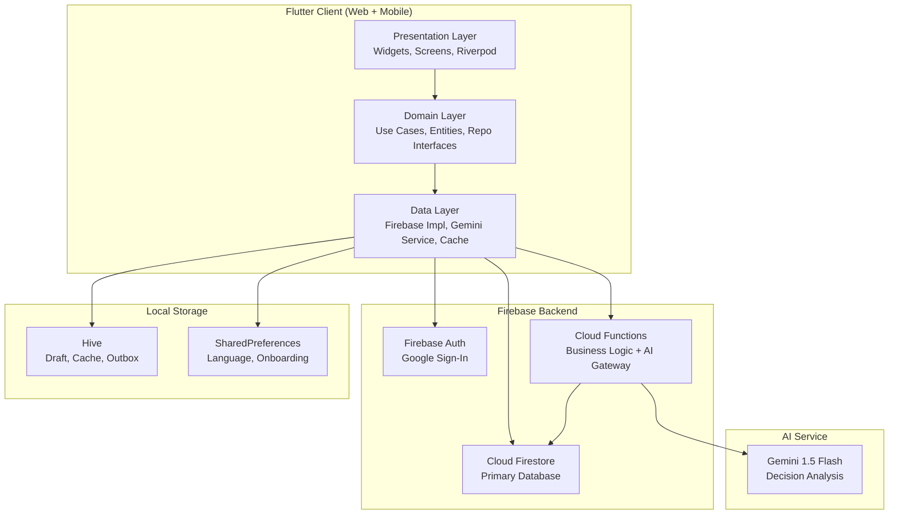
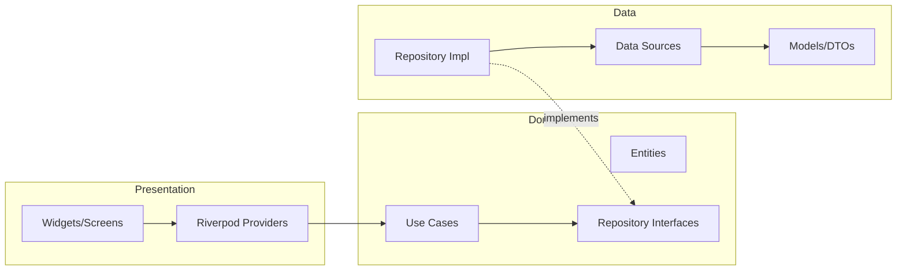
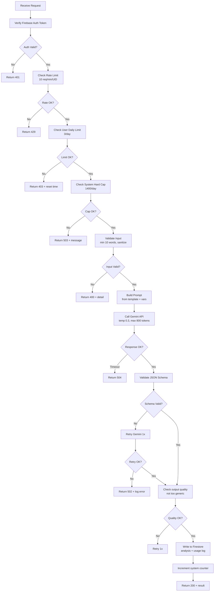
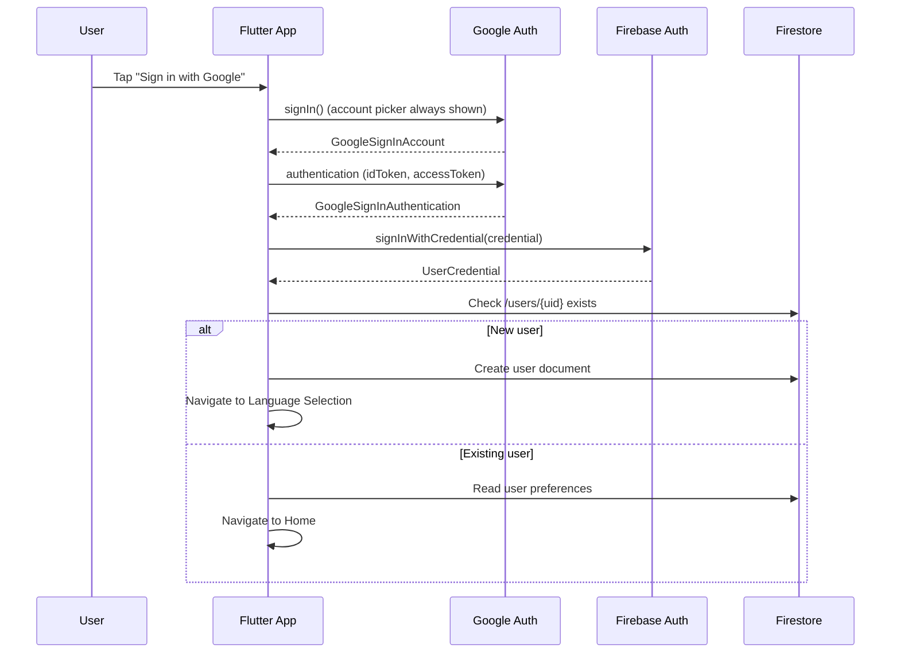
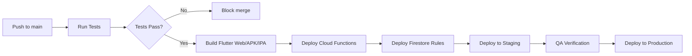

# 🔧 Technical Specification Document (TSD)
## Nalara — Decision Intelligence Platform
**Versi:** 1.0.0-MVP | **Tanggal:** 6 Mei 2026 | **Status:** Draft

---

## 1. System Architecture Overview



---

## 2. Clean Architecture

### 2.1 Layer Diagram



### 2.2 Dependency Rule
- **Presentation → Domain → Data** (outer layers depend on inner)
- Domain layer has **zero dependencies** on Flutter, Firebase, or any external package
- Data layer implements interfaces defined in Domain

---

## 3. Folder Structure

```
lib/
├── core/
│   ├── theme/
│   │   ├── app_theme.dart           # ThemeData configuration
│   │   └── dark_theme.dart          # Dark mode (future)
│   ├── colors/
│   │   └── app_colors.dart          # Centralized color palette
│   ├── typography/
│   │   └── app_typography.dart      # Text styles
│   ├── constants/
│   │   ├── app_constants.dart       # Global constants
│   │   ├── api_constants.dart       # API endpoints, limits
│   │   └── hive_constants.dart      # Box names, type IDs
│   ├── prompts/
│   │   ├── prompt_id.dart           # Indonesian prompt template
│   │   └── prompt_en.dart           # English prompt template
│   ├── errors/
│   │   ├── failures.dart            # Failure classes
│   │   └── exceptions.dart          # Exception classes
│   └── network/
│       └── connectivity_service.dart
├── features/
│   ├── auth/
│   │   ├── data/
│   │   │   ├── datasources/
│   │   │   │   └── auth_remote_datasource.dart
│   │   │   ├── models/
│   │   │   │   └── user_model.dart
│   │   │   └── repositories/
│   │   │       └── auth_repository_impl.dart
│   │   ├── domain/
│   │   │   ├── entities/
│   │   │   │   └── user_entity.dart
│   │   │   ├── repositories/
│   │   │   │   └── auth_repository.dart
│   │   │   └── usecases/
│   │   │       ├── sign_in_with_google.dart
│   │   │       └── sign_out.dart
│   │   └── presentation/
│   │       ├── providers/
│   │       │   └── auth_provider.dart
│   │       └── screens/
│   │           ├── login_screen.dart
│   │           └── language_selection_screen.dart
│   ├── decision/
│   │   ├── data/
│   │   │   ├── datasources/
│   │   │   │   ├── decision_remote_datasource.dart
│   │   │   │   └── decision_local_datasource.dart
│   │   │   ├── models/
│   │   │   │   └── decision_model.dart
│   │   │   └── repositories/
│   │   │       └── decision_repository_impl.dart
│   │   ├── domain/
│   │   │   ├── entities/
│   │   │   │   └── decision_entity.dart
│   │   │   ├── repositories/
│   │   │   │   └── decision_repository.dart
│   │   │   └── usecases/
│   │   │       ├── create_decision.dart
│   │   │       ├── get_decisions.dart
│   │   │       ├── save_decision.dart
│   │   │       └── delete_draft.dart
│   │   └── presentation/
│   │       ├── providers/
│   │       │   └── decision_provider.dart
│   │       ├── screens/
│   │       │   ├── input_screen.dart
│   │       │   ├── history_screen.dart
│   │       │   └── detail_screen.dart
│   │       └── widgets/
│   │           ├── decision_card.dart
│   │           └── category_selector.dart
│   └── analysis/
│       ├── data/
│       │   ├── datasources/
│       │   │   ├── analysis_remote_datasource.dart
│       │   │   └── analysis_local_datasource.dart
│       │   ├── models/
│       │   │   ├── analysis_model.dart
│       │   │   └── scenario_model.dart
│       │   └── repositories/
│       │       └── analysis_repository_impl.dart
│       ├── domain/
│       │   ├── entities/
│       │   │   ├── analysis_entity.dart
│       │   │   └── scenario_entity.dart
│       │   ├── repositories/
│       │   │   └── analysis_repository.dart
│       │   └── usecases/
│       │       ├── analyze_decision.dart
│       │       ├── get_analysis.dart
│       │       └── check_usage_limit.dart
│       └── presentation/
│           ├── providers/
│           │   └── analysis_provider.dart
│           ├── screens/
│           │   ├── loading_screen.dart
│           │   └── result_screen.dart
│           └── widgets/
│               ├── scenario_card.dart
│               ├── indicator_card.dart
│               ├── prevention_card.dart
│               └── confidence_badge.dart
├── shared/
│   ├── widgets/
│   │   ├── app_button.dart
│   │   ├── app_card.dart
│   │   ├── app_text_field.dart
│   │   ├── loading_indicator.dart
│   │   ├── error_widget.dart
│   │   ├── empty_state_widget.dart
│   │   ├── offline_banner.dart
│   │   └── reminder_banner.dart
│   └── helpers/
│       ├── date_helper.dart
│       ├── validation_helper.dart
│       ├── json_parser.dart
│       └── sync_manager.dart
└── l10n/
    ├── app_id.arb
    └── app_en.arb
```

---

## 4. Technology Stack

| Component | Technology | Version | Purpose |
|-----------|-----------|---------|---------|
| Framework | Flutter | 3.x (SDK ^3.10.8) | Cross-platform UI |
| Language | Dart | ^3.10.8 | Application logic |
| State Mgmt | Riverpod | latest | Reactive state management |
| Auth | Firebase Auth | latest | Google Sign-In |
| Database | Cloud Firestore | latest | Primary data store |
| Functions | Cloud Functions (Node.js) | v2 | Backend logic, AI gateway |
| AI | Gemini 1.5 Flash | latest | Decision analysis |
| Local DB | Hive | latest | Local cache, drafts |
| Preferences | SharedPreferences | latest | Lightweight settings |
| Localization | Flutter intl (ARB) | built-in | Multi-language support |
| Code Gen | build_runner, hive_generator | latest | Hive type adapters |
| HTTP | http / dio | latest | Cloud Functions calls |

---

## 5. Cloud Functions Specification

### 5.1 Function: `analyzeDecision`

**Trigger:** HTTPS Callable  
**Runtime:** Node.js 18+  
**Timeout:** 15 seconds  
**Memory:** 256 MB

```
POST /analyzeDecision
Headers: Authorization: Bearer <firebase_id_token>
Body: {
  "inputText": "string",
  "category": "karir | finansial",
  "language": "id | en",
  "decisionId": "string (optional, for regenerate)"
}
```

**Processing Flow:**



**Response:**
```json
{
  "success": true,
  "data": { /* Gemini JSON output */ },
  "usage": {
    "remaining": 2,
    "resetAt": "2026-05-07T00:00:00+07:00"
  }
}
```

### 5.2 Function: `checkUsageLimit`

**Trigger:** HTTPS Callable  
**Purpose:** Client checks remaining usage before showing UI

```
Response: {
  "dailyLimit": 3,
  "used": 1,
  "remaining": 2,
  "resetAt": "2026-05-07T00:00:00+07:00",
  "aiEnabled": true
}
```

### 5.3 Function: `cleanupExpiredData` (Scheduled)

**Trigger:** Cloud Scheduler (daily 02:00 WIB)  
**Tasks:**
- Reset `system_config.currentDailyUsage` to 0
- Delete AI usage logs older than 90 days
- Delete dismissed reminders older than 30 days

---

## 6. Gemini AI Integration

### 6.1 Request Construction

```javascript
// Cloud Function - build Gemini request
const prompt = language === 'id' 
  ? buildIndonesianPrompt(category, jsonSchema, inputText)
  : buildEnglishPrompt(category, jsonSchema, inputText);

const result = await model.generateContent({
  contents: [{ role: 'user', parts: [{ text: prompt }] }],
  generationConfig: {
    temperature: 0.3,
    maxOutputTokens: 800,
    responseMimeType: 'application/json',
  },
  safetySettings: [
    { category: 'HARM_CATEGORY_DANGEROUS_CONTENT', threshold: 'BLOCK_MEDIUM_AND_ABOVE' },
  ],
});
```

### 6.2 Response Validation

```javascript
function validateGeminiResponse(response) {
  // 1. Parse JSON
  const parsed = JSON.parse(response);
  
  // 2. Check required fields
  if (!parsed.scenarios || parsed.scenarios.length !== 3) throw new Error('Invalid scenarios count');
  if (!['rendah','sedang','tinggi'].includes(parsed.overall_confidence)) throw new Error('Invalid confidence');
  
  // 3. Validate each scenario
  for (const s of parsed.scenarios) {
    if (!s.id || !s.title || !s.narrative) throw new Error('Missing scenario fields');
    if (s.early_indicators?.length !== 3) throw new Error('Must have 3 indicators');
    if (!s.prevention_actions?.length) throw new Error('Missing prevention actions');
    // Validate timing enum
    for (const a of s.prevention_actions) {
      const validTimings = ['hari ini','besok','minggu ini','bulan ini','today','tomorrow','this week','this month'];
      if (!validTimings.includes(a.timing)) throw new Error(`Invalid timing: ${a.timing}`);
    }
  }
  
  // 4. Check for generic output (heuristic)
  const genericPhrases = ['secara umum', 'pada umumnya', 'in general', 'generally'];
  const narrative = parsed.scenarios.map(s => s.narrative).join(' ').toLowerCase();
  const genericCount = genericPhrases.filter(p => narrative.includes(p)).length;
  if (genericCount >= 2) throw new Error('Output too generic');
  
  return parsed;
}
```

---

## 7. Authentication Flow



**Key rules:**
- `GoogleSignIn().signIn()` — always shows account picker (no silent sign-in)
- On sign-out: clear all Hive boxes, SharedPreferences, and Firebase auth state

---

## 8. Performance Targets & Optimization

| Metric | Target | Strategy |
|--------|--------|----------|
| Home screen load | < 2s | Cache-first, lazy load history |
| History load | < 1.5s | Cursor pagination (10/page), Hive cache |
| AI response | < 8s | Gemini Flash, 800 token limit |
| JSON parse | < 300ms | Efficient Dart parsing |
| App startup | < 3s | Minimal init, deferred loading |

**Optimization techniques:**
- Riverpod `select()` to prevent unnecessary widget rebuilds
- Firestore queries with specific filters and composite indexes
- Cursor-based pagination (not offset) for history
- Lazy loading for long lists
- Hive cache to reduce Firestore reads

---

## 9. Security Specification

| Concern | Implementation |
|---------|---------------|
| Transport | HTTPS only (all communications) |
| API Key | Gemini key in Cloud Functions env only, never in client |
| Data Access | Firestore Security Rules — owner-only access |
| Input Sanitization | Client: min 10 words, strip invalid chars; Server: re-validate |
| Rate Limiting | Cloud Functions: 10 req/min/UID → HTTP 429 |
| Usage Limits | Server-side validation in Cloud Functions (not client-only) |
| Local Data | Hive encryption for sensitive data |
| Auth | Firebase Auth with Google OAuth 2.0 |
| CORS | Cloud Functions configured for allowed origins only |

---

## 10. Error Handling Strategy

| Error Type | Client Behavior | Retry |
|-----------|----------------|-------|
| No internet | Offline banner + retry button | Manual |
| Auth expired | Re-authenticate silently | Auto 1x |
| Firestore write fail | Retry 2x → save to Hive outbox | Auto 2x |
| Gemini timeout (>10s) | Error state + retry button | Manual |
| Invalid JSON from AI | Log + retry 1x → generic error | Auto 1x |
| Rate limit (429) | Show wait message | No |
| Daily limit (403) | Disable button + show reset time | No |
| Hard cap (503) | Show system message | No |
| Generic server error | Error state + retry button | Manual |

---

## 11. Deployment & CI/CD

### 11.1 Environments

| Env | Firebase Project | Purpose |
|-----|-----------------|---------|
| Development | nalara-dev | Local testing |
| Staging | nalara-staging | QA & UAT |
| Production | nalara-prod | Live users |

### 11.2 Deployment Pipeline



---

## 12. Monitoring & Observability

| Aspect | Tool | Metrics |
|--------|------|---------|
| Crashes | Firebase Crashlytics | Crash rate, ANR rate |
| Performance | Firebase Performance | Screen load times, network latency |
| Analytics | Firebase Analytics | User flow, feature usage, retention |
| AI Monitoring | Cloud Functions logs | Success rate, latency, token usage, error types |
| Alerts | Cloud Monitoring | Hard cap approach (>80%), error spike, latency spike |
| Cost | Firebase billing alerts | Daily Firestore ops, Gemini API cost |

---

*Dokumen ini adalah living document dan akan diperbarui seiring perkembangan teknis.*
