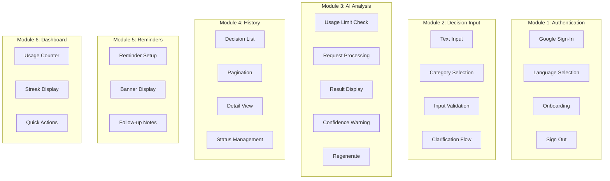
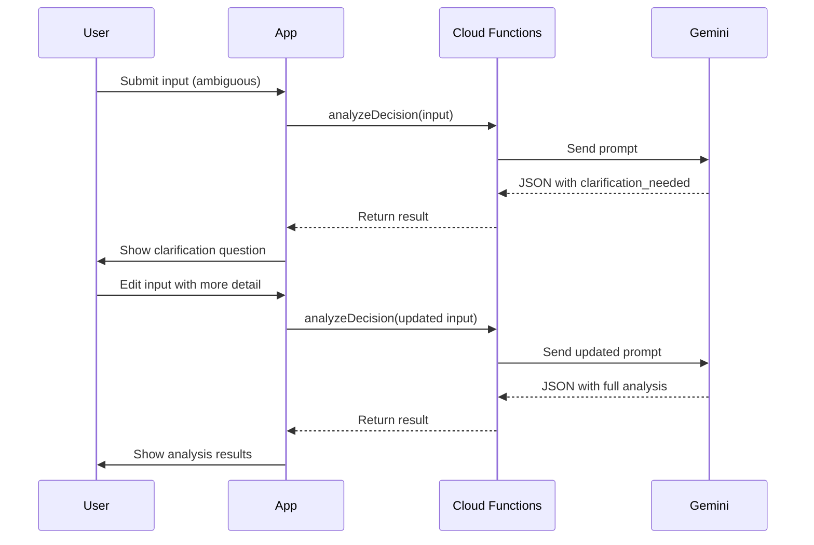

# ⚙️ Functional Specification Document (FSD)
## Nalara — Decision Intelligence Platform
**Versi:** 1.0.0-MVP | **Tanggal:** 6 Mei 2026 | **Status:** Draft

---

## 1. Functional Modules Overview



---

## 2. Module 1: Authentication

### 2.1 F-AUTH-001: Google Sign-In

| Spec | Detail |
|------|--------|
| **Trigger** | User taps "Sign in with Google" button |
| **Pre-condition** | User has a Google account |
| **Behavior** | Account picker **always** displayed (no silent login) |
| **Post-condition** | User authenticated, redirected based on user state |

**Business Logic:**
1. Invoke `GoogleSignIn().signIn()` — force account picker
2. Obtain `idToken` and `accessToken`
3. Create `GoogleAuthProvider.credential()`
4. Call `FirebaseAuth.signInWithCredential()`
5. Check if user document exists in `/users/{uid}`
   - **New user** → create document → navigate to Language Selection
   - **Existing user** → load preferences → navigate to Home

**Error Handling:**
| Error | User-Facing Message | Action |
|-------|---------------------|--------|
| Network error | "Tidak ada koneksi internet" | Show retry button |
| Auth cancelled | — | Stay on login screen |
| Auth failed | "Login gagal, coba lagi" | Show retry button |

### 2.2 F-AUTH-002: Language Selection

| Spec | Detail |
|------|--------|
| **Screen** | Two large selection cards: 🇮🇩 Indonesia / 🇬🇧 English |
| **Storage** | Save to SharedPreferences (`app_language`) + Firestore (`users/{uid}.language`) |
| **Trigger** | First login only, or accessible from settings |
| **Post-condition** | All UI strings switch to selected language immediately |

### 2.3 F-AUTH-003: Onboarding Tooltip

| Spec | Detail |
|------|--------|
| **Trigger** | First time user reaches Home screen |
| **Format** | 2-3 step tooltip overlay highlighting key UI elements |
| **Skip** | User can skip at any step |
| **Completion** | Set `onboardingDone: true` in SharedPreferences + Firestore |
| **Duration target** | < 60 seconds total |

### 2.4 F-AUTH-004: Sign Out

| Spec | Detail |
|------|--------|
| **Trigger** | User taps "Keluar" in settings/profile |
| **Confirmation** | Show confirmation dialog (destructive action) |
| **Actions** | Clear Firebase Auth, clear all Hive boxes, clear SharedPreferences, navigate to Login |

---

## 3. Module 2: Decision Input

### 3.1 F-DEC-001: Text Input

| Spec | Detail |
|------|--------|
| **Component** | Multi-line TextField with character counter |
| **Min length** | 10 words |
| **Max length** | 500 characters |
| **Placeholder** | "Deskripsikan keputusan yang sedang kamu pertimbangkan..." |
| **Validation** | Real-time word count display |

### 3.2 F-DEC-002: Category Selection

| Spec | Detail |
|------|--------|
| **Options** | Karier (💼) / Finansial (💰) |
| **Component** | Two toggle chips, exactly one must be selected |
| **Default** | None selected (user must choose) |
| **Required** | Yes — Analisis button disabled until selected |

### 3.3 F-DEC-003: Input Validation Rules

| Rule | Condition | Action |
|------|-----------|--------|
| V-001 | Word count < 10 | Show message: "Deskripsikan keputusanmu lebih detail (minimal 10 kata)" |
| V-002 | No category selected | Analisis button disabled |
| V-003 | Input too ambiguous | Show clarification request (see F-DEC-004) |
| V-004 | Invalid characters detected | Strip silently, log |
| V-005 | All valid | Enable Analisis button with primary styling |

**Word counting logic:**
```dart
int countWords(String text) {
  return text.trim().split(RegExp(r'\s+')).where((w) => w.isNotEmpty).length;
}
```

### 3.4 F-DEC-004: Clarification Flow

| Spec | Detail |
|------|--------|
| **Trigger** | AI returns `clarification_needed != null` |
| **Display** | Inline card below input with AI's question |
| **User action** | Edit/append to original input text |
| **Re-submit** | Counts as 1 additional AI usage |



---

## 4. Module 3: AI Analysis

### 4.1 F-ANA-001: Usage Limit Check

**Pre-analysis validation sequence:**

| Step | Check | Fail Action |
|------|-------|-------------|
| 1 | Internet connectivity | Show offline banner |
| 2 | User daily limit (client hint) | Show limit message + reset time |
| 3 | Server-side limit validation | Return 403 if exceeded |
| 4 | System hard cap | Return 503 with maintenance message |

**UI for remaining usage:**
- Display in Home screen: "Tersisa 2 analisis hari ini"
- When exhausted: "Limit analisis tercapai. Reset pukul 00:00 WIB"

### 4.2 F-ANA-002: Loading State

| Spec | Detail |
|------|--------|
| **Text** | "Menganalisis keputusan kamu..." (localized) |
| **Animation** | Pulse/shimmer animation on cards |
| **Timeout** | 10 seconds → show error state |
| **Cancel** | User can navigate back (abort request) |

### 4.3 F-ANA-003: Result Display

Results displayed as **5 separate card sections**:

#### Card 1: Skenario Kegagalan (×3)
| Element | Display |
|---------|---------|
| Title | Bold, max 10 kata |
| Narrative | Regular text, max 3 lines before expand |
| Likelihood | Color-coded badge: 🟢 Rendah, 🟡 Sedang, 🔴 Tinggi |

#### Card 2: Penyebab Utama
| Element | Display |
|---------|---------|
| Per scenario | Linked to scenario ID |
| Text | Max 50 kata, displayed as bullet list |

#### Card 3: Indikator Dini
| Element | Display |
|---------|---------|
| Per scenario | 3 indicators each |
| Format | Numbered list with icon prefix |

#### Card 4: Tindakan Pencegahan
| Element | Display |
|---------|---------|
| Action | Text (max 30 kata) |
| Timing | Colored chip: Today/Tomorrow/This Week/This Month |

#### Card 5: Confidence Level
| Element | Display |
|---------|---------|
| Badge | Large badge: Rendah 🔴 / Sedang 🟡 / Tinggi 🟢 |
| Reason | Shown only if confidence is low |
| Warning | Banner if low confidence |

### 4.4 F-ANA-004: Low Confidence Warning

| Spec | Detail |
|------|--------|
| **Trigger** | `overall_confidence == "rendah"` |
| **Display** | Warning banner at top of results |
| **Message** | "Analisis ini memiliki kepercayaan rendah karena informasi yang diberikan terbatas" |
| **Dismissable** | Yes, but persists in view |

### 4.5 F-ANA-005: Regenerate Analysis

| Spec | Detail |
|------|--------|
| **Trigger** | User taps "Perbaiki Input" |
| **Flow** | Navigate back to input screen with pre-filled text |
| **Usage** | Counts as 1 new analysis toward daily limit |
| **Version** | Analysis version incremented |

---

## 5. Module 4: History

### 5.1 F-HIS-001: Decision List

| Spec | Detail |
|------|--------|
| **Layout** | Vertical scrolling list of decision cards |
| **Per card** | Input text (truncated), category badge, status badge, date |
| **Sorting** | By `createdAt` descending (newest first) |
| **Pagination** | Cursor-based, 10 items per load |
| **Empty state** | Illustration + "Belum ada keputusan yang dianalisis" |

### 5.2 F-HIS-002: Status Visual Badges

| Status | Badge Color | Label (ID) | Label (EN) |
|--------|------------|------------|------------|
| Draft | ⚪ Gray | Draft | Draft |
| Dianalisis | 🔵 Blue | Dianalisis | Analyzed |
| Selesai | 🟢 Green | Selesai | Completed |
| Dihapus | 🔴 Red | Dihapus | Deleted |

### 5.3 F-HIS-003: Pagination

```dart
// Cursor-based pagination
Query query = firestore
  .collection('users/$uid/decisions')
  .orderBy('createdAt', descending: true)
  .limit(10);

if (lastDocument != null) {
  query = query.startAfterDocument(lastDocument);
}
```

### 5.4 F-HIS-004: Detail View

| Section | Content |
|---------|---------|
| Header | Decision text + category + status + date |
| Analysis | Full analysis cards (same as result screen) |
| Notes | User's follow-up notes (if any) |
| Actions | "Tandai Selesai" (if not already), "Tambah Catatan" |

---

## 6. Module 5: Reminders

### 6.1 F-REM-001: Reminder Setup

| Spec | Detail |
|------|--------|
| **Trigger** | User taps "Simpan" on analysis result |
| **Prompt** | "Ingatkan kamu untuk review keputusan ini?" [Ya / Tidak] |
| **If Yes** | Create 2 reminder docs: D+7 and D+30 from now |
| **Storage** | Firestore `/users/{uid}/reminders/` |

### 6.2 F-REM-002: Reminder Banner

| Spec | Detail |
|------|--------|
| **Check** | Every time history screen opens |
| **Query** | `scheduledAt <= now && isDismissed == false` |
| **Display** | Banner at top: "Ada keputusan yang perlu kamu review. Apa yang terjadi?" |
| **Tap** | Navigate to decision detail |
| **Dismiss** | Swipe or tap X → set `isDismissed: true` |

### 6.3 F-REM-003: Follow-up Notes

| Spec | Detail |
|------|--------|
| **Trigger** | User taps reminder banner → opens detail |
| **Input** | TextField for reflection notes |
| **Save** | Update `decisions/{id}.notes` in Firestore |
| **Status** | Optionally mark decision as "Selesai" |

---

## 7. Module 6: Dashboard / Home

### 7.1 F-DASH-001: Usage Counter

| Element | Display |
|---------|---------|
| **Counter** | "Tersisa X analisis hari ini" |
| **Visual** | Progress bar or dots (3 max) |
| **Exhausted** | "Limit tercapai. Reset pukul 00:00 WIB" |
| **Data source** | Cloud Function `checkUsageLimit` on screen load |

### 7.2 F-DASH-002: Streak Display

| Element | Display |
|---------|---------|
| **Current** | "🔥 3 hari berturut-turut" |
| **Logic** | Increment if `lastActiveDate` = yesterday; reset if gap > 1 day |
| **Longest** | "Streak terpanjang: 7 hari" |
| **Update** | On successful analysis completion |

### 7.3 F-DASH-003: Quick Actions

| Button | Action |
|--------|--------|
| "Analisis Baru" (Primary CTA) | Navigate to Input screen |
| "Histori" | Navigate to History screen |

---

## 8. Localization Matrix

### 8.1 Key Strings (Sample)

| Key | Indonesia | English |
|-----|-----------|---------|
| `app_title` | Nalara | Nalara |
| `tagline` | Keputusan lebih tajam, risiko lebih terlihat | Sharper decisions, visible risks |
| `btn_analyze` | Analisis | Analyze |
| `btn_save` | Simpan | Save |
| `btn_retry` | Coba Lagi | Retry |
| `loading_analysis` | Menganalisis keputusan kamu... | Analyzing your decision... |
| `category_career` | Karier | Career |
| `category_financial` | Finansial | Financial |
| `status_draft` | Draft | Draft |
| `status_analyzed` | Dianalisis | Analyzed |
| `status_completed` | Selesai | Completed |
| `limit_remaining` | Tersisa {count} analisis hari ini | {count} analyses remaining today |
| `limit_exhausted` | Limit tercapai. Reset pukul 00:00 WIB | Limit reached. Resets at 00:00 WIB |
| `error_offline` | Tidak ada koneksi internet | No internet connection |
| `error_timeout` | Analisis timeout, coba lagi | Analysis timed out, try again |
| `confidence_low_warning` | Analisis ini memiliki kepercayaan rendah | This analysis has low confidence |
| `reminder_banner` | Ada keputusan yang perlu kamu review | You have a decision to review |
| `timing_today` | hari ini | today |
| `timing_tomorrow` | besok | tomorrow |
| `timing_this_week` | minggu ini | this week |
| `timing_this_month` | bulan ini | this month |

### 8.2 ARB File Structure

```json
// l10n/app_id.arb
{
  "@@locale": "id",
  "appTitle": "Nalara",
  "btnAnalyze": "Analisis",
  "limitRemaining": "Tersisa {count} analisis hari ini",
  "@limitRemaining": {
    "placeholders": {
      "count": { "type": "int" }
    }
  }
}
```

---

## 9. State Management (Riverpod)

### 9.1 Key Providers

| Provider | Type | Purpose |
|----------|------|---------|
| `authProvider` | StateNotifier | Auth state (User / null) |
| `languageProvider` | StateProvider | Current language ("id" / "en") |
| `decisionInputProvider` | StateNotifier | Input form state |
| `analysisProvider` | AsyncNotifier | Analysis request lifecycle |
| `usageLimitProvider` | FutureProvider | Current usage/remaining |
| `historyProvider` | AsyncNotifier | Paginated history list |
| `reminderProvider` | FutureProvider | Pending reminders |
| `streakProvider` | Provider | Current/longest streak |
| `connectivityProvider` | StreamProvider | Online/offline status |

### 9.2 Analysis State Machine

```dart
sealed class AnalysisState {}
class AnalysisInitial extends AnalysisState {}
class AnalysisLoading extends AnalysisState {}
class AnalysisClarificationNeeded extends AnalysisState {
  final String question;
}
class AnalysisSuccess extends AnalysisState {
  final AnalysisEntity result;
}
class AnalysisLowConfidence extends AnalysisState {
  final AnalysisEntity result;
  final String reason;
}
class AnalysisError extends AnalysisState {
  final String message;
  final bool canRetry;
}
class AnalysisLimitReached extends AnalysisState {
  final DateTime resetAt;
}
```

---

## 10. Edge Cases & Special Handling

| Scenario | Handling |
|----------|----------|
| User submits same decision twice | Allow — treated as separate analyses |
| User force-kills app during analysis | Draft saved in Hive, can resume |
| Multiple devices, same account | Last-write-wins via Firestore `updatedAt` |
| Gemini returns 4 or 2 scenarios | Invalid — retry 1x, then error |
| User changes language mid-analysis | Current analysis keeps original language; future uses new |
| User's timezone not WIB | Server uses WIB (UTC+7) for all limit resets |
| App opened after 24h with drafts | Expired drafts auto-deleted on app launch |
| Firestore offline persistence | Enabled — writes queued until online |

---

## 11. Accessibility Requirements

| Requirement | Implementation |
|------------|---------------|
| Screen reader support | All interactive elements have semantic labels |
| Touch targets | Minimum 48×48 dp |
| Color contrast | WCAG AA minimum (4.5:1 for text) |
| Font scaling | Respect system font size preferences |
| Focus indicators | Visible focus rings on all interactive elements |
| Alternative text | All icons have tooltips/labels |

---

*Dokumen ini adalah living document dan akan diperbarui seiring perkembangan fungsional.*
